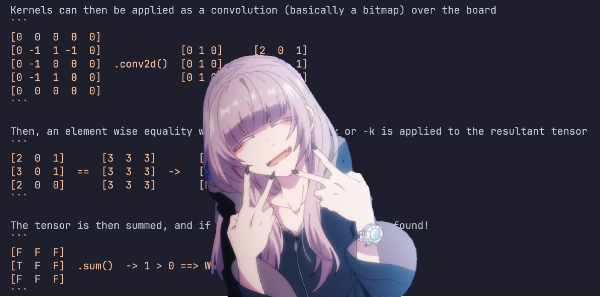

# Tensor Tic Tac Toe

Parallelized and generalized implementation of a 2D TicTacToe win condition verifier



--- 

## Spec

N: dimension of board (N,N) 

K: length of line required to win

## Usage

```bash
pip install tinygrad
python tinygrad_ttt.py
```

## How this works

Win conditions are factored into 4 types: horizontal, vertical, diagonal and anti-diagonal

Vertical is the transpose (flip also works) of horizontal, and anti-diagonal is the flip of diagonal

All of them can be concatenated into a single conv kernel of shape

```
(n_conditions, 1, k, k) 
n_conditions (aka channels) := k * 2 - 2
```

Example: for a 3x3 board, that requires 3 things in a row to win:

```
[[[[0 0 0] 
   [1 1 1]
   [0 0 0]]] # horizontal

 [[[0 1 0]
   [0 1 0]
   [0 1 0]]] # vertical

 [[[1 0 0]
   [0 1 0]
   [0 0 1]]] # diagonal

 [[[0 0 1]
   [0 1 0]
   [1 0 0]]]] # anti-diagonal
```

This is fully general!, example: K = 5

```
[[[[0 0 0 0 0]
   [1 1 1 1 1]
   [0 0 0 0 0]
   [0 0 0 0 0]
   [0 0 0 0 0]]] # horizontal 1

 [[[0 1 0 0 0]
   [0 1 0 0 0]
   [0 1 0 0 0]
   [0 1 0 0 0]
   [0 1 0 0 0]]] # vertical 1

 [[[0 0 0 0 0]
   [0 0 0 0 0]
   [1 1 1 1 1]
   [0 0 0 0 0]
   [0 0 0 0 0]]] # horizontal 2

 [[[0 0 1 0 0]
   [0 0 1 0 0]
   [0 0 1 0 0]
   [0 0 1 0 0]
   [0 0 1 0 0]]] # vertical 2

 [[[0 0 0 0 0]
   [0 0 0 0 0]
   [0 0 0 0 0]
   [1 1 1 1 1]
   [0 0 0 0 0]]] # horizontal 3

 [[[0 0 0 1 0]
   [0 0 0 1 0]
   [0 0 0 1 0]
   [0 0 0 1 0]
   [0 0 0 1 0]]] # vertical 3

 [[[1 0 0 0 0]
   [0 1 0 0 0]
   [0 0 1 0 0]
   [0 0 0 1 0]
   [0 0 0 0 1]]] # diagonal

 [[[0 0 0 0 1]
   [0 0 0 1 0]
   [0 0 1 0 0]
   [0 1 0 0 0]
   [1 0 0 0 0]]]] # anti-diagonal
```

The board is then padded to allow the conv to go over the edges of the board


Kernels can then be applied as a convolution (basically a bitmap) over the board
```
[0  0  0  0  0]
[0 -1  1 -1  0]             [0 1 0]     [2  0  1] 
[0 -1  0  0  0]  .conv2d()  [0 1 0] ->  [3  0  1]
[0 -1  1  0  0]             [0 1 0]     [2  0  0]
[0  0  0  0  0]
```

Then, an element wise equality with a tensor full of k or -k is applied to the resultant tensor
```
[2  0  1]      [3  3  3]       [F  F  F]
[3  0  1]  ==  [3  3  3]  ->   [T  F  F]
[2  0  0]      [3  3  3]       [F  F  F]
```

The tensor is then summed, and if it's bigger than 0, a win is found! 
```
[F  F  F]
[T  F  F]  .sum()  -> 1 > 0 ==> Win!!!
[F  F  F]
```

---
## Todo

- [ ] Batched to handle multiple boards in one kernel (implicitly already does this, too lazy to fix)
- [ ] Handle bigger N and K (stuck at ~512 and ~64 right now)
- [ ] Optimizations, I highly suspect I'm doing more convs than needed

--- 

## Text I sent to a Claude in a haze at 3am

> just realized i can formulate the win conditions of tictactoe with tensor ops

> the kernels are the horizontal and verticals of 1..n-1 indexes filled out with 1
>   plus identity and flipped identity for the diagonals
> so a board of size n and line win condition k can be verified in parallel as a
> conv, pad 1, stride 1
> with a (k,n,n) kernel (k-2 for horizontal/vertical, 2 for diagonals)

> kernels are then pooled, then checked for occurrences of k. (maybe with a flattened tensor of shape (2, k,n,n) with ks and -ks on every entry. then summed. 1 means win, 0 means loss
